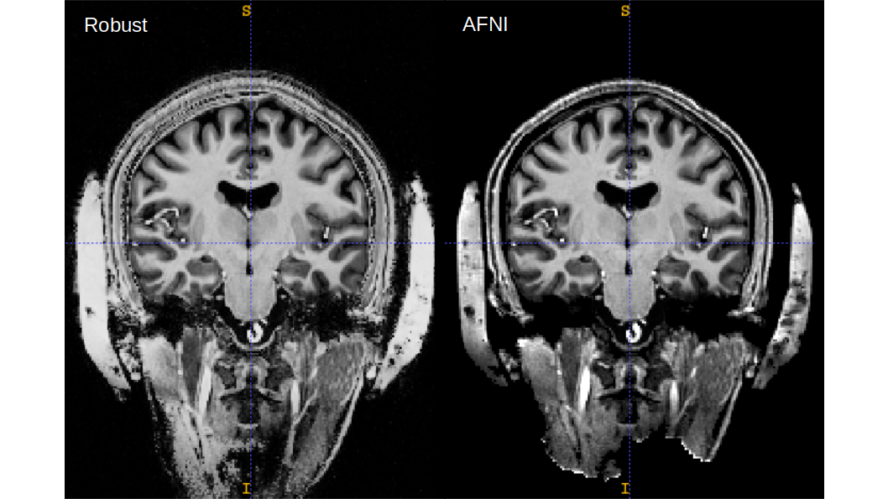
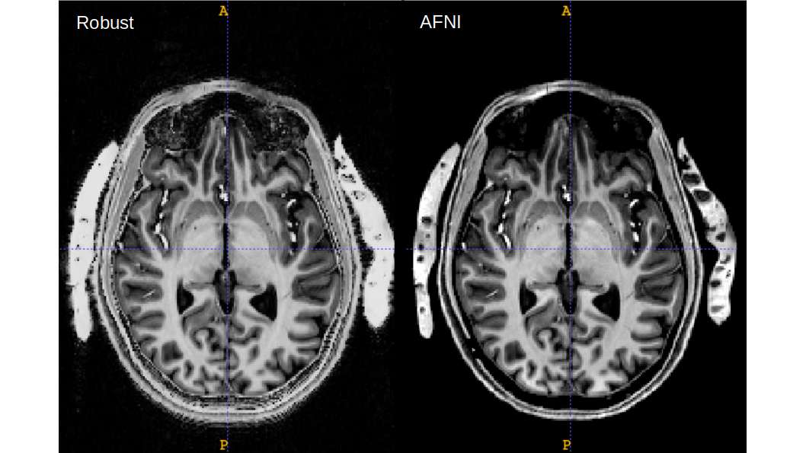

# 3dMPRAGEise

Quick MP2RAGE UNI background cleaning script. 

All **AFNI**. No other dependencies.

Usage: `3dMPRAGEise -i INV2.nii -u UNI.nii`

# Example
Comparing to [MP2RAGE Robust Script](https://github.com/JosePMarques/MP2RAGE-related-scripts/blob/master/DemoRemoveBackgroundNoise.m)

